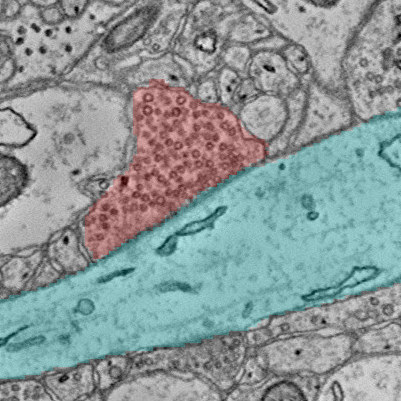
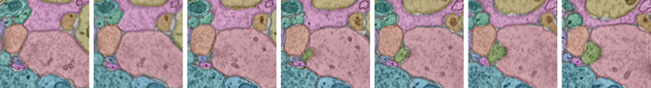

# ImageryClient

Connectomics data often involves a combination of microscopy imagery and segmentation, labels of distinct objects applied to this imagery.
While exploring the data in tools like [Neuroglancer](https://github.com/google/neuroglancer) is great, a common task is often to make figures overlaying 2d images and segmentation sliced from the larger data.
ImageryClient is designed to make it easy to generate aligned cutouts from imagery and segmentation, and make it efficient to produce attractive, publication-ready overlay images.

Because of the size of these volumes, cloud-based serverless n-d array file storage systems are often used to host this data.
[CloudVolume](https://github.com/seung-lab/cloud-volume/) has become an excellent general purpose tool for accessing such data.
However, imagery and segmentation for the same data are hosted at distinct cloud locations and can differ in basic properties like base resolution.
Moreover, imagery and segmentation have data that means intrensically different things.
Values in imagery indicate pixel intensity in order to produce a picture, while values in segmentation indicate the object id at a given location.
ImageryClient acts as a front end for making aligned cutouts from multiple cloudvolume sources, splitting segmentations into masks for each object, and more.

We make use of [Numpy arrays](https://numpy.org/doc/stable/) and [Pillow Images](https://pillow.readthedocs.io/) to represent data.
Both are extremely rich tools, and to learn more about them please see the appropriate documentation for information about saving data to image files and more. 

## Installation

The standard installation:

`pip install imageryclient`

If you have installation issues due to Cloudvolume, which has a fairly complex set of requirements, we recommend looking at their github [issues page](https://github.com/seung-lab/cloud-volume/issues) for help.

## How to use ImageryClient

Here, we will use the ImageryClient to get some data from the [Kasthuri et al. 2014 dataset](https://neuroglancer-demo.appspot.com/fafb.html#!gs://fafb-ffn1/main_ng.json) hosted by Google.
In its simplest form, we just intialize an ImageryClient object with an image cloudpath and a segmentation cloudpath.
Values are taken from the layers in the linked neuroglancer state.

```python
import imageryclient as ic

img_src = 'precomputed://gs://neuroglancer-public-data/kasthuri2011/image_color_corrected'
seg_src = 'precomputed://gs://neuroglancer-public-data/kasthuri2011/ground_truth'

img_client = ic.ImageryClient(image_source=img_src, segmentation_source=seg_src)
```

### Imagery cutouts

Cutouts are defined by their bounds, which can be specified by providing bounds.
The most direct form is a pair of points representing the upper and lower corners of the bounding box.
By default, coordinates are in the default resolution of the imagery as you would see in neuroglancer.

```python
bounds = [
    [5119, 8477, 1201],
    [5519, 8877, 1202]
]

image = img_client.image_cutout(bounds)

# Use PIL to visualize
from PIL import Image
Image.fromarray(image.T)
```


Since often we are using analysis points to center an image on, we can alternatively define a center point and the width/height/depth of the bounding box (in voxels).
The same image could be achived from this specification.
```python
ctr = [5319, 8677, 1201]
img_width = 400
image = img_client.image_cutout(ctr, bbox_size=(img_width, img_width))
```

You can also generate bounds from a center and size.
```python
bounds = ic.bounds_from_center(ctr, width=img_width, height=img_width, depth=1)
```

### Resolution

A very important element in ImageryClient is the resolution, which specifies the units that you are using when providing bounds.
You can check the resolution that the client is expecting with `img_client.resolution`.
The resolution will default to the highest resolution available for the imagery, but you can specify another resolution manually.
For example, to say that you are going to provide bounds in `[8,8,30]` voxel units, you would add the `resolution` argument:

```python
img_client = ic.ImageryClient(..., resolution=[8,8,30])
```
You can also explicitly set the resolution to `"image"` or `"segmentation"` to use the highest available resolution available for either.
Resolution can also be specified in each of the functions for image or segmentation cutouts, but will default to the client values.

Note that the volumetric data itself is not necessarily at the resolution specified, but rather this parameter determines how to interpret the _coordinates_.
The resolution is set by the image and segmentation mip levels, which can be added either when creating the ImageryClient instance or when doing any cutout download.
By default, ImageryClient will use the highest resolution mip level that is not labeled as a `"placeholder"` in CloudVolume.

#### Specifying image size instead of field of view

When upper and lower bounds are specified or a `bbox_size` is used, the resolution will change with mip level but the field of view that is downloaded will remain the same.
Alternatively, one might want to download an image with a specific size in pixels and a specific mip level without having to calculate what bounding box would get you that..
This can be done in `image_cutout` by specifying the center point in the place of bounds and also specify `image_size` as a 2- or 3-element array.
In this case, the center point will be adjusted according to the resolutions specified, while the field of view will change with image size.

In practice, this only is needed for non-default mip levels. 
If you specify mip level, this approach will always yield an image with the same size while a bounds-based approach will get smaller with increasing mips as the effective resolution gets coarser.

For example, using bounds:
```python
image = img_client.image_cutout(bounds, mip=3)
Image.fromarray(image.T)
```


And using specified pixel dimensions:
```python
img_size=(400, 400)
image = img_client.image_cutout(ctr, mip=3, image_size=img_size)
Image.fromarray(image.T)
```


You can also use the `scale_to_bounds=True` argument to upscale an image to the size specified in the bounding box, equivalent to having one pixel for each voxel as measured by the resolution parameter.

### Segmentations

An aligned segmentation cutout is retrieved similarly.
Note that segmentations show segment ids, and are not directly visualizable.
However, in this case we can convert to a uint8 greyscale and see the gist, although there are many better approaches to coloring segmentations that will be shown later.
Note that for dynamic segmentations, you can use the timestamp parameter to (optionally) set the time at which segmentation will e looked up.

```python
seg = img_client.segmentation_cutout(bounds)

import numpy as np
Image.fromarray( (seg.T / np.max(seg) * 255).astype('uint8') )
```


Specific root ids can also be specified. All pixels outside those root ids have a value of 0.

```python
root_ids = [2282, 4845]
seg = img_client.segmentation_cutout(bounds, root_ids=root_ids)
Image.fromarray( (seg.T / np.max(seg) * 255).astype('uint8') )
```


### Split segmentations

It's often convenient to split out the segmentation for each root id as a distinct mask. These "split segmentations" come back as a dictionary with root id as key and binary mask as value.

```python
split_seg = img_client.split_segmentation_cutout(bounds, root_ids=root_ids)

Image.fromarray((split_seg[ root_ids[0] ].T * 255).astype('uint8'))
```


### Aligned cutouts

Aligned image and segmentations can be downloaded in one call, as well.
If the lowest mip data in each differs in resolution, the lower resolution data will be optionally upsampled to the higher resolution in order to produce aligned overlays.
Root ids and split segmentations can be optionally specified. This is the best option if your primary goal is overlay images.

```python
image, segs = img_client.image_and_segmentation_cutout(bounds,
                                                       split_segmentations=True,
                                                       root_ids=root_ids)
```

Note that `image_size` is not an option for joint image and segmentation calls, because it's not clear which bounds to use.
If this is needed, you can use the `img_client.segmentation_bbox_size_from_dimensions` or `img_client.image_bbox_size_from_dimensions` to get the appropriate `bbox_size` argument for a segmentation-based image dimension (or image-based, respectively).

## Producing overlays

Now let produce an overlay of segmentation and imagery to highlight a particular synapse.
Overlays are returned as a [PIL Image](https://pillow.readthedocs.io/en/stable/), which has convenient saving options but can also be converted to RGBa via a simple `np.array` call.
Note that if imagery isn't specified, the segmentations are colored but not put over another image.
Segmentations must be either a list or a dict, such as comes out of split segmentation cutouts.

```python
ic.composite_overlay(segs, imagery=image)
```


### Aesthetic options

Colors are chosen by default from the perceptually uniform discrete [HUSL Palette](https://seaborn.pydata.org/generated/seaborn.husl_palette.html) as implemented in Seaborn, and any color scheme available through Seaborn's [color_palette](https://seaborn.pydata.org/generated/seaborn.color_palette.html?highlight=color_palette) function is similarly easy to specify.
Alpha is similarly easy to set.

```python
ic.composite_overlay(segs, imagery=image, palette='tab10', alpha=0.4)
```


Colors can also be specified in the same form as the segmentations, e.g. a dictionary of root id to RGB tuple.

```python
colors = {2282: (0,1,1), # cyan
          4845: (1,0,0)} # red
ic.composite_overlay(segs, imagery=image, colors=colors)
```



### Outline options

While the overlay guides the eye, it can also obscure the imagery.
Because of that, one can also use highly configurable outlines instead of solid overlays.
The default option puts the outlines along the outside of the segmentations, but omits lines where two segmentations touch.

```python
ic.composite_overlay(segs, imagery=image, outline=True, alpha=0.5, width=15, colors=colors)
```


Outlines can also be put inside of the segmentation and width can be specified.
Additionally, setting `merge_outline` to False will not omit outlines in places where segmentations touch.
Lots of different effects are possible!

```python
ic.composite_overlay(segs,
                     imagery=image,
                     outline=True,
                     alpha=1,
                     width=3,
                     merge_outline=False,
                     side='in',
                     colors=colors)
```


## 3d Image Stacks

All of the functions are designed to also work for 3d image stacks.
Image and segmentation cutouts will return 3d arrays instead of 2d ones.
However, note that composite images will come back as a list of PIL images.
An optional `dim` argument will perform the slicing on axes other than the z-axis, although anisotropy in voxel resolution will not be accounted for.

```python
ctr = [5019, 8677, 1211]
width = 100
z_slices = 3

bounds_3d = ic.bounds_from_center(ctr, delx=width, dely=width, delz=z_slices)

image, segs = img_client.image_and_segmentation_cutout(bounds_3d, split_segmentations=True)

overlays = ic.composite_overlay(segs, imagery=image, alpha=0.3, width=3,
                                merge_outline=False, side='in')

overlays[0]
```


In order to quickly assemble sequential images into a series, we can stack them.
A `direction` argument will let you specify `vertical` instead of the default, and spacing can be adjusted as well.

```python
ic.stack_images(overlays)
```



## Using the CAVEclient

While the ImageryClient was designed to work specifically with the [CAVEclient](https://github.com/seung-lab/CAVEclient)
and its associated suite of services, it should work with any cloudvolume project.

However, if you are working within an CAVEclient-compatible project, a CAVEclient can be used to help configure the ImageryClient, filling in the imagery source, the segmentation source, authentication information, and the default resolution used in Neuroglancer.

For example, we can download the data around [this view of the MICRoNs mouse visual cortex data from Neuroglancer](https://ngl.microns-explorer.org/#!%7B%22dimensions%22:%7B%22x%22:%5B4e-9%2C%22m%22%5D%2C%22y%22:%5B4e-9%2C%22m%22%5D%2C%22z%22:%5B4e-8%2C%22m%22%5D%7D%2C%22position%22:%5B240640.5%2C207872.5%2C21360.5%5D%2C%22crossSectionScale%22:0.9700751861624107%2C%22projectionOrientation%22:%5B0.021348824724555016%2C-0.17453671991825104%2C-0.007549765054136515%2C-0.9843902587890625%5D%2C%22projectionScale%22:489587.6696286937%2C%22layers%22:%5B%7B%22type%22:%22image%22%2C%22source%22:%7B%22url%22:%22precomputed://https://bossdb-open-data.s3.amazonaws.com/iarpa_microns/minnie/minnie65/em%22%2C%22subsources%22:%7B%22default%22:true%7D%2C%22enableDefaultSubsources%22:false%7D%2C%22tab%22:%22source%22%2C%22shaderControls%22:%7B%22normalized%22:%7B%22range%22:%5B86%2C172%5D%7D%7D%2C%22name%22:%22img65%22%7D%2C%7B%22type%22:%22image%22%2C%22source%22:%7B%22url%22:%22precomputed://https://bossdb-open-data.s3.amazonaws.com/iarpa_microns/minnie/minnie35/em%22%2C%22subsources%22:%7B%22default%22:true%7D%2C%22enableDefaultSubsources%22:false%7D%2C%22tab%22:%22source%22%2C%22shaderControls%22:%7B%22normalized%22:%7B%22range%22:%5B112%2C172%5D%7D%7D%2C%22name%22:%22img35%22%7D%2C%7B%22type%22:%22segmentation%22%2C%22source%22:%22precomputed://gs://iarpa_microns/minnie/minnie65/seg%22%2C%22tab%22:%22segments%22%2C%22annotationColor%22:%22#8f8f8a%22%2C%22selectedAlpha%22:0.41%2C%22notSelectedAlpha%22:0.06%2C%22colorSeed%22:1689220695%2C%22name%22:%22seg65%22%7D%2C%7B%22type%22:%22segmentation%22%2C%22source%22:%22precomputed://gs://iarpa_microns/minnie/minnie35/seg%22%2C%22tab%22:%22segments%22%2C%22annotationColor%22:%22#8a8a8a%22%2C%22segments%22:%5B%22864691137827278437%22%2C%22864691138020403235%22%2C%22864691138081021535%22%2C%22864691138134948293%22%2C%22864691138142870469%22%2C%22864691138153699060%22%2C%22864691138178964470%22%2C%22864691138345166401%22%5D%2C%22name%22:%22seg35%22%7D%5D%2C%22showSlices%22:false%2C%22selectedLayer%22:%7B%22visible%22:true%2C%22layer%22:%22seg65%22%7D%2C%22layout%22:%7B%22type%22:%22xy%22%2C%22orthographicProjection%22:true%7D%7D).

```python
from caveclient import CAVEclient
client = CAVEclient('minnie65_public_v343') .  # Note that you have to set up a token for this to work, see below.

img_client = ic.ImageryClient(client=client)

ctr = [240640, 207872, 21360]

image, segs = img_client.image_and_segmentation_cutout(ctr,
                                                       split_segmentations=True,
                                                       bbox_size=(1024, 1024),
                                                       scale_to_bounds=True,
)

ic.composite_overlay(segs, imagery=image, palette='husl')
```


Note that the following code requires setting up a CAVE token to access the server. [See here for details](https://github.com/AllenInstitute/MicronsBinder/blob/master/notebooks/mm3_intro/CAVEsetup.ipynb).
